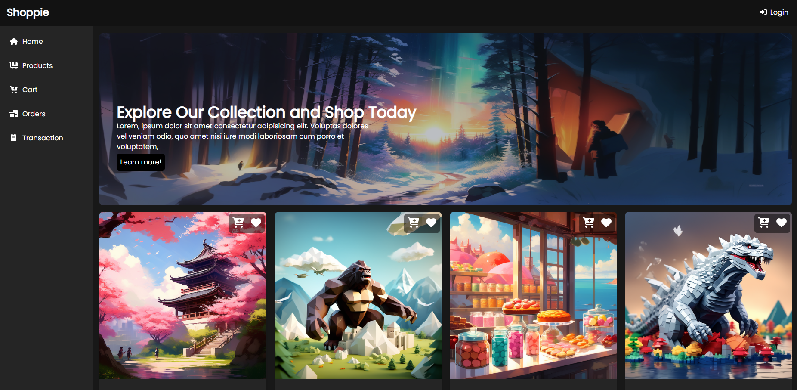
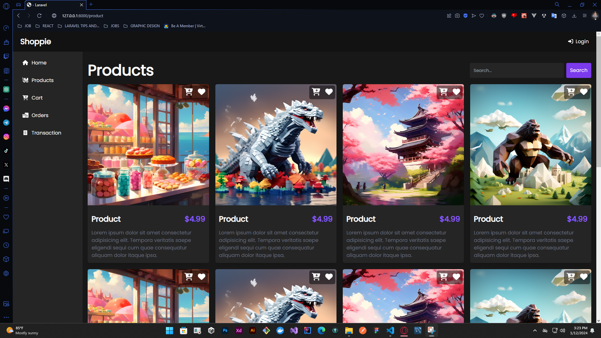

# Shoppie E-commerce Website

Welcome to Shoppie, your go-to e-commerce platform! This Laravel-based website is designed to provide a seamless shopping experience with a modern and responsive user interface. Shoppie is built using Shadcn UI for Laravel and Tailwind CSS, combining elegance with functionality.

## Table of Contents

1. [Getting Started](#getting-started)
    - [Prerequisites](#prerequisites)
    - [Installation](#installation)
2. [Features](#features)
3. [Technologies Used](#technologies-used)
4. [Contributing](#contributing)
5. [License](#license)

## Getting Started

### Prerequisites

Before you begin, ensure you have the following prerequisites:

-   [Laravel](https://laravel.com/docs/10.x/installation)
-   [Inertiajs](https://inertiajs.com)
-   [Tailwindcss](https://tailwindcss.com/docs/installation)
-   [Shandcn](https://ui.shadcn.com)

### Installation

1. Clone the repository:

    ```bash
    git clone https://github.com/yourusername/shoppie.git
    ```

2. Navigate to the project directory:
    ```bash
    cd shoppie
    ```
3. Install dependencies:
    ```bash
     composer install
     npm install
    ```
4. Set up your environment file:

    ```bash
    cp .env.example .env
    ```

    Update the database and other configurations in the .env file.

5. Generate application key:

    ```bash
    php artisan key:generate
    ```

6. Run database migrations
    ```bash
    php artisan migrate
    ```
7. Compile assets:
    ```bash
    npm run dev
    ```
    Note: make sure that you open and run seperate terminal for both npm dependecies and laravel composer
   
9. Start the development server:
    ```bash
    php artisan serve
    ```
    Your Shoppie e-commerce website is now accessible at http://localhost:8000.

## Features

-   User Authentication
-   Product Catalog
-   Shopping Cart
-   Checkout Process
-   Order History
-   Admin Panel for Managing Products and Orders
-   Responsive Design

## Demo

Check out these screenshots for a glimpse of Shoppie:





## Contributing

We welcome contributions to enhance Shoppie. Feel free to open issues, submit pull requests, or suggest improvements.

## License

This project is licensed under the MIT License - see the [LICENSE](LICENSE) file for details.
